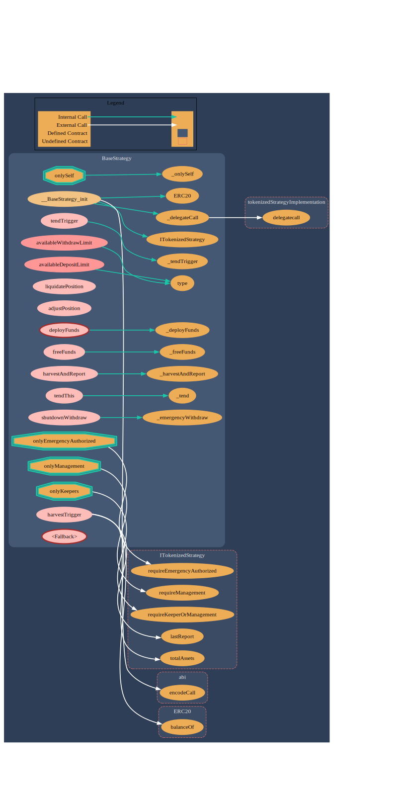

# Base Strategy

## Smart Contract Overview:

This is an abstract contract that should be inherited by a specific strategy. It implements all of the required functionality toseamlessly integrate with the `TokenizedStrategy` implementation contract allowing anyone to easily build a fully permissionless ERC-4626 compliant Vault by inheriting this contract and overriding four simple functions.

It utilizes an immutable proxy pattern that allows the BaseStrategy to remain simple and small. All standard logic is held within the
`TokenizedStrategy` and is reused over any n strategies all using the `fallback` function to delegatecall the implementation so that strategists can only be concerned with writing their strategy specific code.

This contract should be inherited and the four main abstract methods `_deployFunds`, `_freeFunds`, `_harvestAndReport` and `liquidatePosition` implemented to adapt the Strategy to the particular needs it has to generate yield. There are
other optional methods that can be implemented to further customize
the strategy if desired.

All default storage for the strategy is controlled and updated by the
`TokenizedStrategy`. The implementation holds a storage struct that
contains all needed global variables in a manual storage slot. This
means strategists can feel free to implement their own custom storage
variables as they need with no concern of collisions. All global variables
can be viewed within the Strategy by a simple call using the
`TokenizedStrategy` variable. IE: TokenizedStrategy.globalVariable();.

## Smart Contract Flow Diagram:

