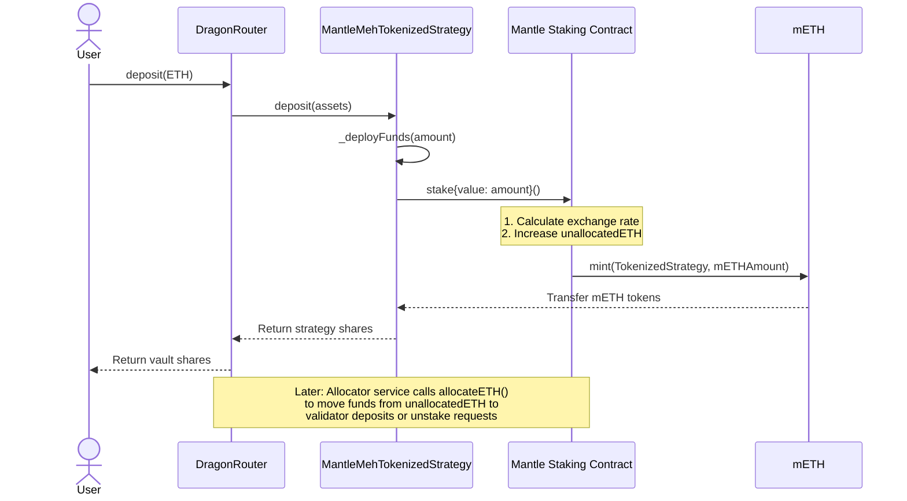
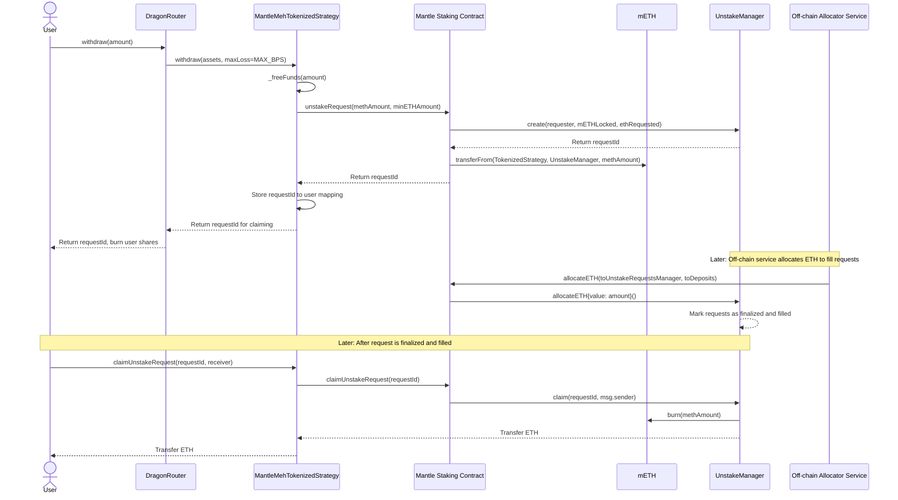
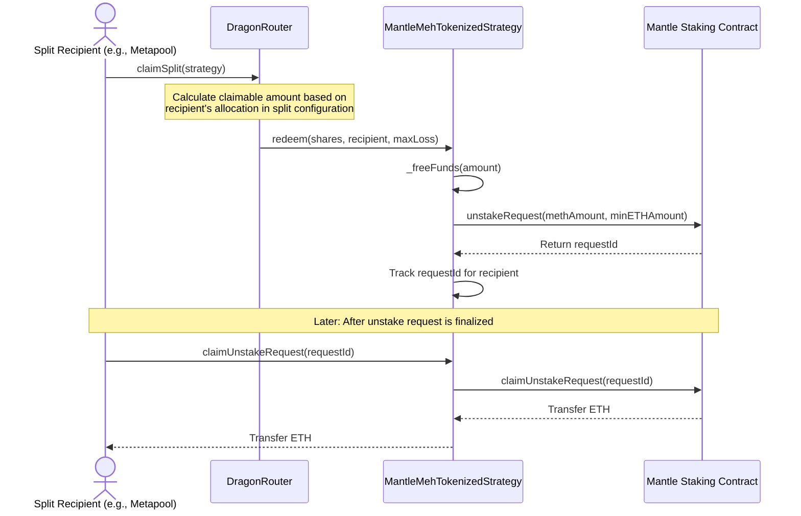

# MantleMehTokenizedStrategy.sol

## High-Level Overview

MantleMehTokenizedStrategy is a specialized yield-generating strategy contract that integrates with Mantle's staking protocol to generate yield on ETH by staking it for mETH. The strategy inherits from both DragonBaseStrategy and implements ReentrancyGuard, enabling secure multisig control and standardized strategy operations.

The strategy's primary purpose is to automatically stake ETH into Mantle's protocol, optimize yields, and handle withdrawals efficiently while maintaining proper access control through a Safe multisig owner and enforcing Octant protocol invariants through DragonTokenizedStrategy delegated calls.

## Functionality Breakdown

### Mantle Integration System:
- Implementation: Interfaces with Mantle staking contract through standardized stake/unstake operations
- Security Considerations: 
  - Requires infinite approvals to Mantle staking during setup
  - Handles unstake requests tracking for each user
  - Manages claimed request verification
- Key Interactions:
  - Direct stake/unstake with Mantle staking contract
  - mETH token management
  - Exchange rate calculations for accurate asset valuation

### Modular Security Framework:
- Implementation: Utilizes Zodiac's Module system for enhanced access control
- Security Considerations:
  - Multisig ownership structure
  - Avatar and target pattern for controlled execution
  - Ownership transfer protections
- Key Interactions:
  - Setup configuration
  - Permission management
  - Safe multisig integration

## Contract Summary

Main functions:
- `setUp(bytes)`: Initializes strategy with configuration parameters
- `_deployFunds(uint256)`: Stakes ETH in Mantle protocol
- `_freeFunds(uint256)`: Submits unstake requests to Mantle protocol
- `_harvestAndReport()`: Calculates and reports total asset value
- `_tend(uint256)`: Stakes any idle ETH in the contract
- `_emergencyWithdraw(uint256)`: Emergency withdrawal functionality via unstake requests
- `claimUnstakeRequest(uint256)`: Allows users to claim completed unstake requests

## Inherited Contracts

1. DragonBaseStrategy:
- Provides the core strategy functionality
- Manages the asset operations
- Handles fallback to the TokenizedStrategy implementation

2. ReentrancyGuard:
- Prevents reentrancy attacks in critical functions
- Secures unstake claim operations

## Security Analysis

### Storage Layout

Storage variables and types:
```solidity
// Constants
address public constant MANTLE_STAKING = 0xe3cBd06D7dadB3F4e6557bAb7EdD924CD1489E8f;
address public constant METH_TOKEN = 0xd5F7838F5C461fefF7FE49ea5ebaF7728bB0ADfa;

// Mappings
mapping(address => uint256[]) public userUnstakeRequests;
mapping(uint256 => bool) public unstakeRequestClaimed;

// Inherited storage from DragonBaseStrategy
address public tokenizedStrategyImplementation;
uint256 public maxReportDelay;
```

Storage considerations:
- Constant addresses for Mantle staking and mETH token
- User-specific unstake request tracking
- Request claim status tracking
- Inherited pattern ensures proper storage slot management

### Constants

1. MANTLE_STAKING (address):
- Value: 0xe3cBd06D7dadB3F4e6557bAb7EdD924CD1489E8f
- Purpose: Mantle staking contract address for ETH staking
- Immutable and cannot be changed
- Used in all staking/unstaking operations

2. METH_TOKEN (address):
- Value: 0xd5F7838F5C461fefF7FE49ea5ebaF7728bB0ADfa
- Purpose: Mantle's mETH token address
- Immutable and cannot be changed
- Used to track staked ETH value

### Method Analysis

#### Method: _harvestAndReport

Calculates and reports the total value of assets managed by the strategy.

```solidity
function _harvestAndReport() internal override returns (uint256) {
    // Get current balance of mETH
    uint256 mEthBalance = IERC20(METH_TOKEN).balanceOf(address(this));
    
    // Calculate ETH value based on exchange rate
    uint256 ethValue = convertMETHToAssets(mEthBalance);
    
    // Add any ETH we have in the contract
    ethValue += address(this).balance;

    return ethValue;
}
```

1. Internal function overriding base strategy's harvest method
2. Gets current mETH balance held by the strategy
3. Converts mETH to ETH value using current exchange rate
4. Adds any direct ETH balance in the contract
5. Returns total ETH value of all assets

Unlike Yearn's implementation which withdraws assets from the yield source, Mantle's implementation calculates value based on current balances and exchange rates, avoiding unnecessary transactions.

#### Method: _deployFunds

Stakes ETH into the Mantle protocol.

```solidity
function _deployFunds(uint256 _amount) internal override {
    if (_amount > 0) {
        // Convert ETH to mETH by staking
        IMantleStaking(MANTLE_STAKING).stake{value: _amount}();
    }
}
```

1. Internal function to stake ETH with Mantle
2. Checks if amount is greater than zero before staking
3. Calls Mantle staking contract with ETH value

#### Method: _freeFunds

Initiates unstake requests to free funds.

```solidity
function _freeFunds(uint256 _amount) internal virtual override {
    // Convert to mETH equivalent
    uint256 methAmount = convertAssetsToMETH(_amount);
    
    // Submit unstake request
    uint256 requestId = IMantleStaking(MANTLE_STAKING).unstakeRequest(
        uint128(methAmount),
        uint128(_amount) // Minimum ETH amount expected
    );

    address _msgSender = IDragonTokenizedStrategy(address(this)).msgSender();
    userUnstakeRequests[_msgSender].push(requestId);
}
```

1. Internal function overriding base strategy's fund freeing method
2. Converts requested ETH amount to equivalent mETH
3. Submits unstake request to Mantle staking contract
4. Gets the current caller through DragonTokenizedStrategy
5. Tracks the unstake request for the user

#### Method: _tend

Stakes any idle ETH in the contract.

```solidity
function _tend(uint256 _idle) internal override {
    // only accessible from the keepers
    if (address(this).balance > 0) {
        IMantleStaking(MANTLE_STAKING).stake{value: address(this).balance}();
    }
}
```

1. Internal function overriding base strategy's tend method
2. Checks if contract has any ETH balance
3. Stakes all available ETH if balance is positive

#### Method: claimUnstakeRequest

Allows users to claim completed unstake requests.

```solidity
function claimUnstakeRequest(uint256 requestId) external override nonReentrant {
    // Check if request belongs to caller
    bool found = false;
    uint256[] storage userRequests = userUnstakeRequests[msg.sender];
    
    for (uint256 i = 0; i < userRequests.length; i++) {
        if (userRequests[i] == requestId) {
            found = true;
            break;
        }
    }
    require(found, NotYourRequest());
    
    require(!unstakeRequestClaimed[requestId], RequestAlreadyClaimed());
    
    // Check if request is finalized and filled
    (bool finalized, uint256 filledAmount) = IMantleStaking(MANTLE_STAKING).unstakeRequestInfo(requestId);
    
    require(finalized && filledAmount > 0, RequestNotReady());
    
    // Claim the ETH from Mantle
    IMantleStaking(MANTLE_STAKING).claimUnstakeRequest(requestId);
    
    // Mark as claimed
    unstakeRequestClaimed[requestId] = true;
    
    // Send ETH to the user
    (bool success, ) = msg.sender.call{value: filledAmount}("");
    require(success, ETHTransferFailed());
}
```

1. External function with reentrancy protection
2. Verifies the request belongs to the caller
3. Checks if request has already been claimed
4. Verifies the request is finalized and has ETH to claim
5. Claims the ETH from Mantle
6. Marks the request as claimed
7. Transfers the ETH to the caller


## Mantle Staking Interaction Flows

### Deposit Flow


### Withdrawal Flow



### Profit Flow




