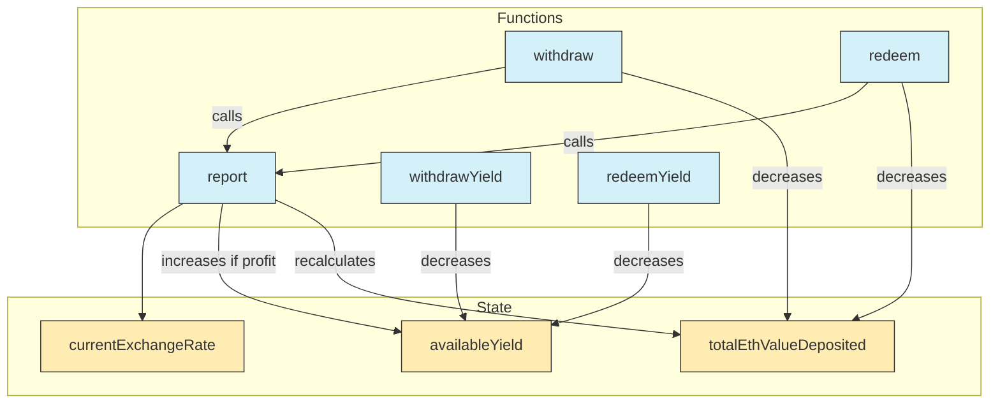

# Contract Summary and Internal Security Audit Report on YieldBearingDragonTokenizedStrategy

## YieldBearingDragonTokenizedStrategy.sol

### High-Level Overview

YieldBearingDragonTokenizedStrategy is a specialized extension of DragonTokenizedStrategy designed specifically for handling yield-bearing tokens like mETH (Mantle's liquid staked ETH). The strategy introduces critical exchange rate tracking, ETH value accounting, and yield management features to ensure that users maintain the ETH value of their deposits while allowing the protocol to capture yield from the appreciation of the token.

This specialized vault allows strategies to capture yield from tokens whose value in ETH terms increases over time (like liquid staked ETH) without requiring active management or external protocol integrations. It maintains a clear separation between principal deposits and generated yield, with custom functions for yield redemption.

### Key Features & Storage Model

#### Storage Isolation

To prevent storage collisions in the proxy pattern, the contract implements a dedicated storage slot:

```solidity
// Use fixed storage slots to avoid collisions in the proxy pattern
bytes32 private constant YIELD_BEARING_STORAGE_POSITION = keccak256("dragon.yield-bearing.storage");

struct YieldBearingStorage {
    /// @notice Total ETH value of all deposits (in wei)
    uint256 totalEthValueDeposited;
    /// @notice Total yield available for withdrawal (in mETH token units)
    uint256 availableYield;
    /// @notice Current exchange rate between the yield-bearing token and ETH
    uint256 currentExchangeRate;
}

function _yieldBearingStorage() private pure returns (YieldBearingStorage storage s) {
    bytes32 position = YIELD_BEARING_STORAGE_POSITION;
    assembly {
        s.slot := position
    }
}
```

#### ETH Value Tracking

The contract tracks the total ETH value of all deposits, which is critical for:

1. Determining the correct profit from exchange rate appreciation
2. Maintaining accurate accounting during deposits and withdrawals
3. Ensuring users maintain their ETH value regardless of token price fluctuations

#### Yield Management

The contract implements dedicated yield management functions:

- `withdrawYield` - Withdraws a specific amount of yield-bearing tokens as yield
- `redeemYield` - Redeems shares for yield-bearing tokens, accounting for it as yield

### State Variable Changes Visualization



### Function Effects Table

| Function        | totalEthValueDeposited                    | availableYield                 | currentExchangeRate |
| --------------- | ----------------------------------------- | ------------------------------ | ------------------- |
| report()        | Recalculates based on balance minus yield | Increases if profit generated  | Updates to latest   |
| withdraw()      | Decreases by assets \* exchangeRate       | Not affected                   | Updates to latest   |
| redeem()        | Decreases by assets \* exchangeRate       | Not affected                   | Updates to latest   |
| withdrawYield() | Not affected                              | Decreases by withdrawal amount | Not affected        |
| redeemYield()   | Not affected                              | Decreases by assets amount     | Not affected        |

### Overridden Functions & Their Changes

#### 1. \_depositWithLockup

**Key Changes:**

- Tracks the ETH value of deposits using the current exchange rate
- Updates the total ETH value deposited for accurate yield accounting
- Stores the current exchange rate for future reference

```solidity
function _depositWithLockup(
  uint256 assets,
  address receiver,
  uint256 lockupDuration
) internal override returns (uint256 shares) {
  YieldBearingStorage storage s = _yieldBearingStorage();

  // Get the current exchange rate before deposit
  uint256 exchangeRate = IMethYieldStrategy(address(this)).getCurrentExchangeRate();
  s.currentExchangeRate = exchangeRate;

  // Calculate ETH value of this deposit
  uint256 depositEthValue = (assets * exchangeRate) / 1e18;

  // Add to the total ETH value
  uint256 previousTotalEthValue = s.totalEthValueDeposited;
  s.totalEthValueDeposited += depositEthValue;

  // Call the parent implementation for the actual deposit
  shares = super._depositWithLockup(assets, receiver, lockupDuration);

  emit TotalEthValueUpdated(previousTotalEthValue, s.totalEthValueDeposited);

  return shares;
}
```

#### 2. withdraw

**Key Changes:**

- Automatically calls report before withdrawal to ensure the latest state
- Updates the current exchange rate
- Calculates and tracks the ETH value being withdrawn
- Updates the total ETH value deposited after withdrawal

```solidity
function withdraw(
  uint256 assets,
  address receiver,
  address owner,
  uint256 maxLoss
) public override returns (uint256 shares) {
  YieldBearingStorage storage s = _yieldBearingStorage();

  ITokenizedStrategy(address(this)).report();

  // Get the current exchange rate
  uint256 exchangeRate = IMethYieldStrategy(address(this)).getCurrentExchangeRate();
  s.currentExchangeRate = exchangeRate;

  // Calculate what portion of total ETH value this withdrawal represents
  uint256 ethValueWithdrawn = (assets * exchangeRate) / 1e18;

  // Perform the withdrawal with parent implementation
  shares = super.withdraw(assets, receiver, owner, maxLoss);

  uint256 previousTotalEthValue = s.totalEthValueDeposited;
  s.totalEthValueDeposited -= ethValueWithdrawn;
  emit TotalEthValueUpdated(previousTotalEthValue, s.totalEthValueDeposited);

  return shares;
}
```

#### 3. redeem

**Key Changes:**

- Automatically calls report before redemption to ensure the latest state
- Updates the current exchange rate
- Calculates assets representation of shares and their ETH value
- Updates the total ETH value deposited after redemption

```solidity
function redeem(
  uint256 shares,
  address receiver,
  address owner,
  uint256 maxLoss
) public override returns (uint256 assets) {
  YieldBearingStorage storage s = _yieldBearingStorage();

  // First report to ensure we have the latest state
  ITokenizedStrategy(address(this)).report();

  // Get the current exchange rate
  uint256 exchangeRate = IMethYieldStrategy(address(this)).getCurrentExchangeRate();
  s.currentExchangeRate = exchangeRate;

  // Determine how many assets these shares represent
  assets = _convertToAssets(super._strategyStorage(), shares, Math.Rounding.Floor);

  // Calculate the ETH value of these assets
  uint256 ethValueWithdrawn = (assets * exchangeRate) / 1e18;

  // Perform the redemption with parent implementation
  assets = super.redeem(shares, receiver, owner, maxLoss);

  uint256 previousTotalEthValue = s.totalEthValueDeposited;
  s.totalEthValueDeposited -= ethValueWithdrawn;

  emit TotalEthValueUpdated(previousTotalEthValue, s.totalEthValueDeposited);

  return assets;
}
```

#### 4. report

**Key Changes:**

- Updates the current exchange rate
- Tracks available yield when profit is generated
- Recalculates the total ETH value based on the mETH balance minus available yield
- Uses the current exchange rate for accurate ETH value calculations

```solidity
function report() public override(DragonTokenizedStrategy) returns (uint256 profit, uint256 loss) {
  YieldBearingStorage storage s = _yieldBearingStorage();

  // Get current exchange rate and update it
  uint256 exchangeRate = IMethYieldStrategy(address(this)).getCurrentExchangeRate();
  s.currentExchangeRate = exchangeRate;

  // Call parent implementation for actual reporting logic
  (profit, loss) = super.report();

  // If we have profit, update available yield
  if (profit > 0) {
    uint256 previousYield = s.availableYield;
    s.availableYield += profit;
    emit AvailableYieldUpdated(previousYield, s.availableYield);

    //total mETH balance minus the mETH profit balance
    uint256 totalMethBalance = super._strategyStorage().asset.balanceOf(address(this));
    uint256 mEthProfitBalance = totalMethBalance - s.availableYield;

    // update total eth value deposited with new exchange rate
    uint256 previousTotalEthValue = s.totalEthValueDeposited;
    s.totalEthValueDeposited = (mEthProfitBalance * exchangeRate) / 1e18;
    emit TotalEthValueUpdated(previousTotalEthValue, s.totalEthValueDeposited);
  }

  return (profit, loss);
}
```

### New Yield Management Functions

#### 1. withdrawYield

This function allows authorized users to withdraw a specific amount of yield-bearing tokens as yield:

```solidity
function withdrawYield(uint256 amount, address receiver, address owner, uint256 maxLoss) external returns (uint256) {
  YieldBearingStorage storage s = _yieldBearingStorage();

  // Check if there's enough yield available
  require(amount <= s.availableYield, "Insufficient yield available");
  require(receiver != address(0), "Cannot withdraw to zero address");

  // Subtract from available yield
  uint256 previousYield = s.availableYield;
  s.availableYield -= amount;

  // Transfer the yield-bearing tokens to the receiver
  uint256 shares = super.withdraw(amount, receiver, owner, maxLoss);

  emit YieldWithdrawn(receiver, amount);
  emit AvailableYieldUpdated(previousYield, s.availableYield);

  return shares;
}
```

#### 2. redeemYield

This function allows authorized users to redeem shares for yield-bearing tokens, accounting for it as yield:

```solidity
function redeemYield(uint256 amount, address receiver, address owner, uint256 maxLoss) external returns (uint256) {
  YieldBearingStorage storage s = _yieldBearingStorage();

  // Subtract from available yield
  uint256 previousYield = s.availableYield;

  // Transfer the yield-bearing tokens to the receiver
  uint256 assets = super.redeem(amount, receiver, owner, maxLoss);

  // reduce the yield available by the assets withdrawn
  s.availableYield -= assets;

  emit YieldWithdrawn(receiver, amount);
  emit AvailableYieldUpdated(previousYield, s.availableYield);

  return assets;
}
```

### Public View Functions

The contract adds two key public view functions:

```solidity
function totalEthValueDeposited() external view returns (uint256) {
  return _yieldBearingStorage().totalEthValueDeposited;
}

function availableYield() external view returns (uint256) {
  return _yieldBearingStorage().availableYield;
}
```

### Example Scenario

1. User deposits 100 mETH at exchange rate 1:1 (worth 100 ETH)

   - totalEthValueDeposited = 100 ETH
   - availableYield = 0 mETH

2. Exchange rate increases to 1.2:1

   - Strategy holds 100 mETH (now worth 120 ETH)
   - During report:
     - Profit of 16.67 mETH is calculated (20 ETH / 1.2)
     - availableYield = 16.67 mETH
     - totalEthValueDeposited remains 100 ETH

3. Protocol withdraws 8 mETH yield:

   - Using withdrawYield:
     - availableYield decreases to 8.67 mETH
     - totalEthValueDeposited remains 100 ETH (unaffected by yield withdrawal)

4. User withdraws half their deposit:

   - report() is automatically called before processing the withdrawal
   - If exchange rate has increased further (e.g., from 1.2:1 to 1.25:1):
     - New profit is calculated and added to availableYield
     - For example, with the new rate: availableYield might increase from 8.67 mETH to 10.67 mETH
   - ETH value to withdraw = 50 ETH
   - Assets to receive = 50 ETH / current_exchange_rate
     - At 1.2:1: 41.67 mETH
     - At 1.25:1: 40 mETH
   - totalEthValueDeposited decreases to 50 ETH
   - User always receives assets worth exactly 50 ETH regardless of exchange rate changes

5. Final state:
   - Strategy holds remaining mETH (total balance minus withdrawn amount)
   - totalEthValueDeposited = 50 ETH
   - availableYield = updated value after withdrawal (includes any newly generated yield)

### Security Implications

1. **Exchange Rate Dependency**

   - Strategy relies on accurate exchange rates from the IMethYieldStrategy interface
   - All profit/loss calculations depend on the integrity of the exchange rate
   - Mitigated by using direct contract calls to the official Mantle staking contract

2. **Precision Loss**

   - Multiple division operations in exchange rate calculations may introduce minor rounding errors
   - Error impact mitigated by using 1e18 precision for exchange rates

3. **Storage Isolation**

   - The use of dedicated storage slots prevents storage collisions in proxy patterns
   - Critical for maintaining accurate accounting in an upgrade-safe manner

4. **Yield Access Control**
   - The withdrawYield and redeemYield functions should have proper access control
   - Only the DragonRouter or other authorized addresses should be able to withdraw yield
   - Inherits access control from DragonTokenizedStrategy
