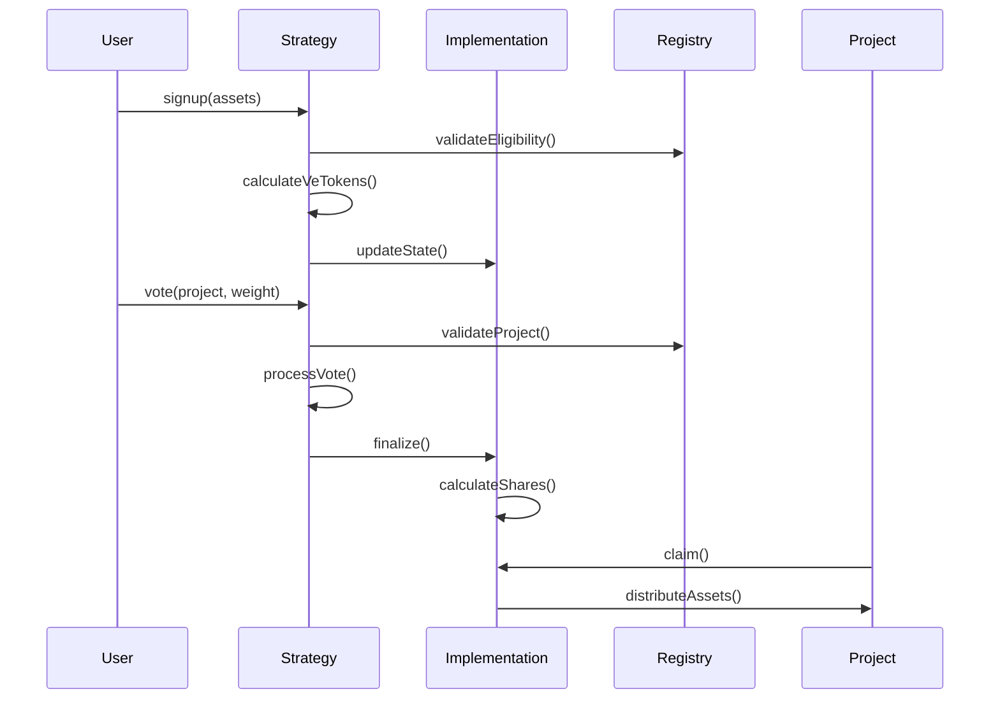

# Impact Strategy Protocol

The Impact Strategy Protocol provides a flexible framework for creating and managing tokenized impact strategies. It uses an immutable proxy pattern to separate core, unchangeable logic from customizable strategy components.

```
User: deposit(assets) -> receive veTokens
User: vote(veTokens, project) -> locks veTokens
Strategy: finalize() -> calculate shares per project
Project: redeem(shares) -> receive underlying assets
```

## Architecture Overview

The protocol uses an immutable proxy pattern to outsource complex, high-risk, and redundant code to a single `ImpactStrategy.sol` implementation contract. Each specific strategy inherits from `BaseImpactStrategy.sol`, which handles communication with the implementation contract through delegatecalls.

```graph TD
    A[Custom Impact Strategy] -->|inherits| B[BaseImpactStrategy]
    B -->|delegatecall| C[ImpactStrategy Implementation]
    D[Project Registry] -->|reads| A
    E[Users] -->|deposit/vote| A
    F[Projects] -->|redeem| A
```

```sequenceDiagram
    participant User
    participant Strategy
    participant Implementation
    participant Registry
    participant Project
    
    User->>Strategy: signup(assets)
    Strategy->>Registry: validateEligibility()
    Strategy->>Strategy: calculateVeTokens()
    
    User->>Strategy: vote(weight, project)
    Strategy->>Registry: validateProject()
    Strategy->>Implementation: _processVote()
    
    User->>Strategy: finalize()
    Strategy->>Implementation: _calculateShares()
    
    Project->>Strategy: claim(shares)
    Implementation->>Project: distributeAssets()
```
### Core Components (Immutable)

- **ImpactStrategy.sol**: The implementation contract containing immutable core logic:
  - Project and user eligibility validation through canonical registry
  - Asset distribution with threshold and cap enforcement
  - Core state management for shares and assets
  - Final allocation calculations

### Modular Components (Customizable)

- **BaseImpactStrategy.sol**: Abstract contract handling:
  - User signup and deposit processing
  - veToken balance management
  - Vote submission and processing
  - Event emissions

- **Custom Strategies**: Individual implementations that define:
  - Custom veToken calculation rules (e.g., quadratic, linear, time-weighted)
  - Specific voting mechanisms
  - Asset type and acceptance rules

## Implementation Pattern

To create a new impact strategy:

1. **Inherit from BaseImpactStrategy**: Extend the `BaseImpactStrategy` contract to leverage its core functionalities and integrate with the `ImpactStrategy` implementation contract.

2. **Implement Required Functions**:
   - `_calculateVeTokens(uint256 amount, address user, uint256 lockTime)`: Define the logic for converting deposited assets into veTokens, considering factors like deposit amount, user-specific multipliers, and lock time.
   - `_processVote(address voter, address project, uint256 weight)`: Implement the mechanism for processing votes, including vote weight calculation, validation, and accounting.
   - `_calculateShares(uint256 totalVotes, uint256 projectRegistryId)`: Determine the share allocation for projects based on their vote tally, using a proportional or custom formula.

3. **Optional Overrides**:
   - `availableDepositLimit(address voter)`: Customize deposit limits for users, potentially implementing whitelists or other restrictions.
   - `availableWithdrawLimit(address project)`: Define withdrawal limits for projects, such as donation caps.
   - `checkSybilResistance(address voter)`: Implement sybil resistance checks, such as Proof of Humanity verification or GitcoinPassport scoring.
   - `adjustVoteTally(address project, uint256 rawTally)`: Apply custom vote decay or adjustment logic to the raw vote tally.
   - `adjustShareAllocation(address project, uint256 baseShares, uint256 projectVotes, uint256 totalVotes)`: Customize share allocation formulas, such as quadratic voting or bonding curves.

4. **Testing and Validation**:
   - Ensure thorough testing of the strategy, including deposit and veToken minting, vote casting and tracking, share allocation, and sybil resistance checks.
   - Validate integration with the project registry and ensure accurate project eligibility and share distribution.

5. **Deployment and Upgrades**:
   - Deploy the strategy with consideration for migration paths and potential upgrades.
   - Utilize the immutable proxy pattern to separate core logic from strategy-specific implementations, allowing for secure and efficient upgrades.

By following this pattern, developers can create robust and flexible impact strategies that leverage the power of decentralized voting and fund allocation.

## Standard Flow



1. **Signup Phase**
   - Users deposit assets
   - Eligibility is verified
   - veTokens are calculated and assigned
   - State is updated via implementation

2. **Voting Phase**
   - Users cast votes using veTokens
   - Project eligibility is verified
   - Votes are processed according to strategy rules
   - Results are accumulated in implementation

3. **Distribution Phase**
   - Round is finalized
   - Shares are calculated based on votes
   - Thresholds and caps are enforced
   - Projects claim their allocated assets

## Testing

Due to the nature of the immutable proxy pattern, testing the implementation contract directly is not 
possible. Instead, we use the pre-built IImpactStrategy interface to cast any deployed strategy. you can add 
any external functions for your specific strategy to this interface to test the functions.

3. **Upgrades**
   - Core logic is immutable
   - Strategy-specific logic can be upgraded
   - Consider migration paths