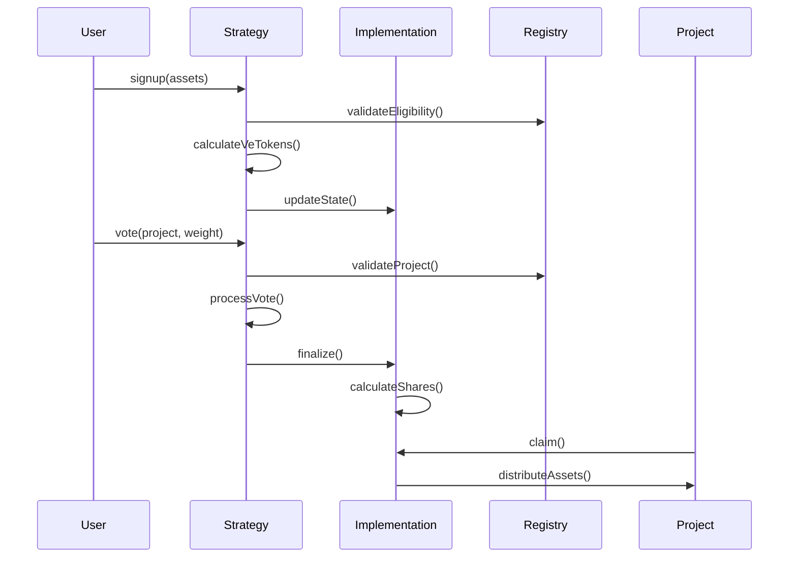

# Impact Strategy Protocol

The Impact Strategy Protocol provides a flexible framework for creating and managing tokenized impact strategies. It uses an immutable proxy pattern to separate core, unchangeable logic from customizable strategy components.

```
User: deposit(assets) -> receive veTokens
User: vote(veTokens, project) -> locks veTokens
Strategy: finalize() -> calculate shares per project
Project: redeem(shares) -> receive underlying assets
```

## Architecture Overview

The protocol uses an immutable proxy pattern to outsource complex, high-risk, and redundant code to a single `ImpactStrategy.sol` implementation contract. Each specific strategy inherits from `BaseImpactStrategy.sol`, which handles communication with the implementation contract through delegatecalls.

```graph TD
    A[Custom Impact Strategy] -->|inherits| B[BaseImpactStrategy]
    B -->|delegatecall| C[ImpactStrategy Implementation]
    D[Project Registry] -->|reads| A
    E[Users] -->|deposit/vote| A
    F[Projects] -->|redeem| A
```

```sequenceDiagram
    participant User
    participant Strategy
    participant Implementation
    participant Registry
    participant Project
    
    User->>Strategy: signup(assets)
    Strategy->>Registry: validateEligibility()
    Strategy->>Strategy: calculateVeTokens()
    
    User->>Strategy: vote(weight, project)
    Strategy->>Registry: validateProject()
    Strategy->>Implementation: _processVote()
    
    User->>Strategy: finalize()
    Strategy->>Implementation: _calculateShares()
    
    Project->>Strategy: claim(shares)
    Implementation->>Project: distributeAssets()
```
### Core Components (Immutable)

- **ImpactStrategy.sol**: The implementation contract containing immutable core logic:
  - Project and user eligibility validation through canonical registry
  - Asset distribution with threshold and cap enforcement
  - Core state management for shares and assets
  - Final allocation calculations

### Modular Components (Customizable)

- **BaseImpactStrategy.sol**: Abstract contract handling:
  - User signup and deposit processing
  - veToken balance management
  - Vote submission and processing
  - Event emissions

- **Custom Strategies**: Individual implementations that define:
  - Custom veToken calculation rules (e.g., quadratic, linear, time-weighted)
  - Specific voting mechanisms
  - Asset type and acceptance rules

## Implementation Pattern

To create a new impact strategy:

1. Inherit from BaseImpactStrategy
2. Implement required functions:
   ```solidity
   function _calculateVeTokens(uint256 amount) internal virtual returns (uint256);
   function _processVote(address voter, address project, uint256 weight) internal virtual returns (bool);
   ```

3. Optional overrides:
   - `_beforeVote()` - Pre-vote validation
   - `_afterVote()` - Post-vote processing
   - Custom modifiers or validation logic

## Standard Flow



1. **Signup Phase**
   - Users deposit assets
   - Eligibility is verified
   - veTokens are calculated and assigned
   - State is updated via implementation

2. **Voting Phase**
   - Users cast votes using veTokens
   - Project eligibility is verified
   - Votes are processed according to strategy rules
   - Results are accumulated in implementation

3. **Distribution Phase**
   - Round is finalized
   - Shares are calculated based on votes
   - Thresholds and caps are enforced
   - Projects claim their allocated assets

## Testing

Due to the nature of the immutable proxy pattern, testing the implementation contract directly is not 
possible. Instead, we use the pre-built IImpactStrategy interface to cast any deployed strategy. you can add 
any external functions for your specific strategy to this interface to test the functions.

3. **Upgrades**
   - Core logic is immutable
   - Strategy-specific logic can be upgraded
   - Consider migration paths