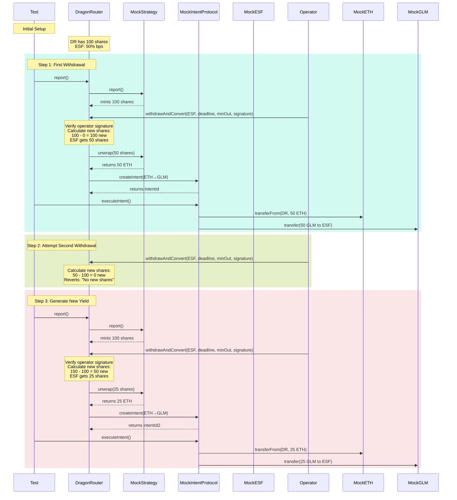

# Dragon Router Schema

## Overview

The Dragon Router is a contract that manages the distribution of yield-bearing strategy shares among recipients, with the ability to convert the underlying assets to desired tokens through an intent-based protocol. It supports operator-based withdrawals for smart contract recipients (like ESF) through ERC-1271 signature validation.

## Core Components

### Recipients

- Each recipient has:
  - `bps`: Allocation percentage in basis points (e.g., 5000 = 50%)
  - `desiredToken`: The token they want to receive (e.g., GLM)
  - `shares`: Total shares allocated to them
  - `redeemedShares`: Number of shares already redeemed

### Share Distribution Flow

1. Strategy generates yield (mints new shares)
2. Dragon Router tracks total shares and recipient allocations
3. When an operator withdraws on behalf of a recipient:
   - Verifies operator signature if recipient is a smart contract
   - Calculates new shares (total shares - sum of all recipient shares)
   - Allocates recipient's portion based on their bps
   - Unwraps shares to underlying asset
   - Creates intent for token conversion
   - Intent protocol handles the actual swap

### Key Features

- Prevents double-claiming of shares
- Automatic distribution of new shares to all recipients
- Intent-based token conversion
- Share tracking per recipient
- Operator authorization for smart contract recipients

## Example Flow

1. Strategy mints 100 new shares
2. Operator withdraws on behalf of ESF (50% bps):
   - Operator signs withdrawal parameters
   - ESF validates operator signature
   - Gets 50 shares
   - Shares unwrapped to ETH
   - ETH converted to GLM via intent
3. Operator cannot withdraw same shares again
4. New yield generates new shares
5. Operator can withdraw ESF's portion of new shares

The key changes in this update are:

1. Added operator authorization flow details
2. Updated the sequence diagram to show operator interactions
3. Clarified the signature verification process
4. Added details about share tracking and redemption
5. Updated the example flow to reflect operator-based withdrawals
